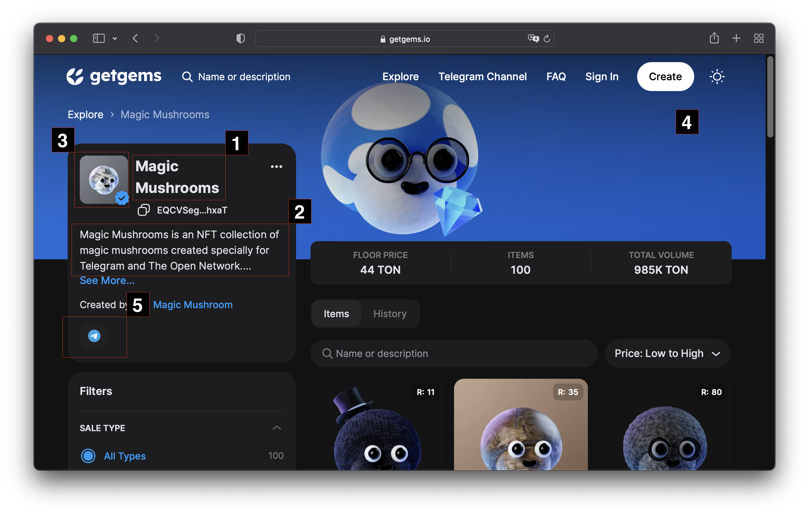
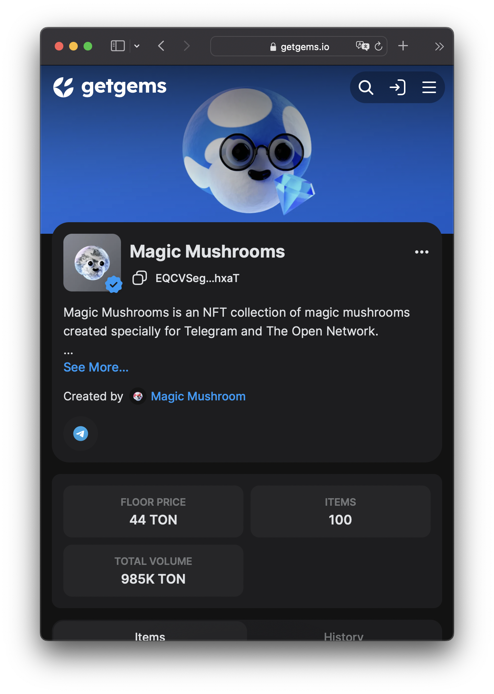
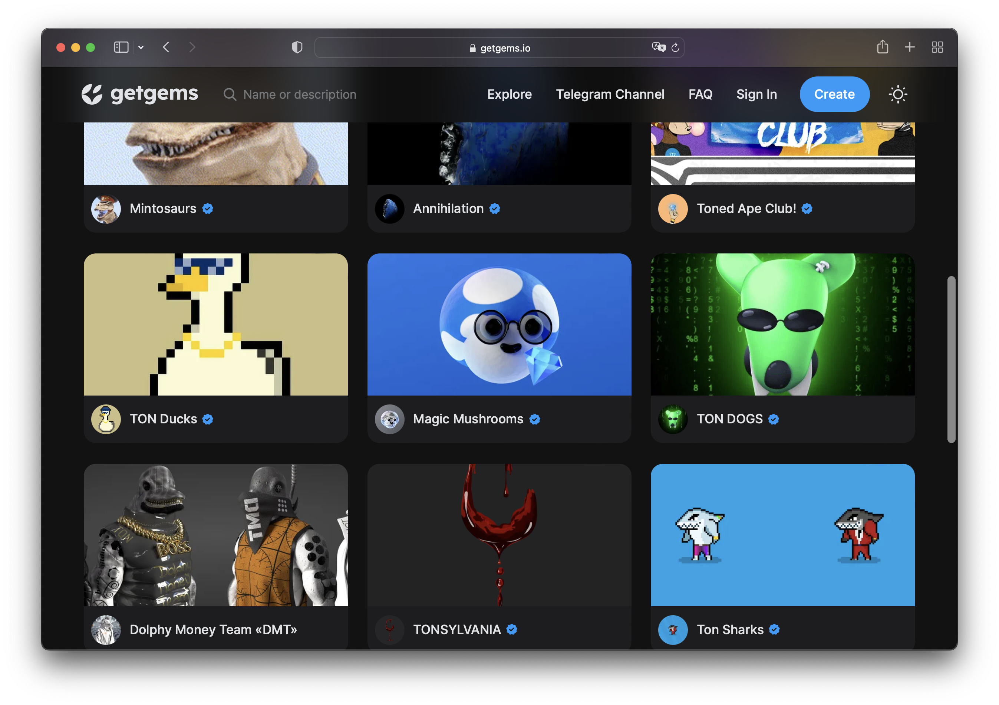

## Collection metadata



Пример json файла метадаты коллекции

```json
{
  "name": "Magic Mushrooms",
  "description": "Magic Mushrooms is an NFT collection of magic mushrooms created specially for Telegram and The Open Network.\n\nHand drawing brings the collection an artistic value, while various accessories and materials bring uniqueness and significance in our rapidly changing world.",
  "image": "https://s.getgems.io/nft/c/62695cb92d780b7496caea3a/avatar.png",
  "cover_image": "https://s.getgems.io/nft/c/62695cb92d780b7496caea3a/cover.png",
  "social_links": [
    "https://t.me/ton_magic_mushrooms"
  ]
}
```

|   |   |   |
|---|---|---|
|[1] name|название коллекции|рекомндуемая длина не более 15-30 символов|
|[2] description|описание коллекции|рекомндуемая длина до 500 символов|
|[3] image|ссылка на изображение|поддерживаются https и ipfs ссылки, рекомендуется использовать квадратное изображение разметом от 400x400 пикселей до 1000x1000 пикселей, поддерживаются форматы png, jpg, gif, webp, svg, размер файла не более 30 мб. Для анимированных изображений количество кадров не более ста.|
|[4] cover_image|ссылка на обложку|поддерживаются https и ipfs ссылки, рекомендуется использовать изображение размером 2880x680 пикселей, поддерживаются форматы png, jpg, gif, webp, svg, размер файла не более 30 мб. Для анимированных изображений количество кадров не более 30. Обратите внимание чтоб это изображение используется для превью коллекции, см. скриншоты|
|[5] social_links|массив со ссылками на соц. сети|не более 10 ссылок|




